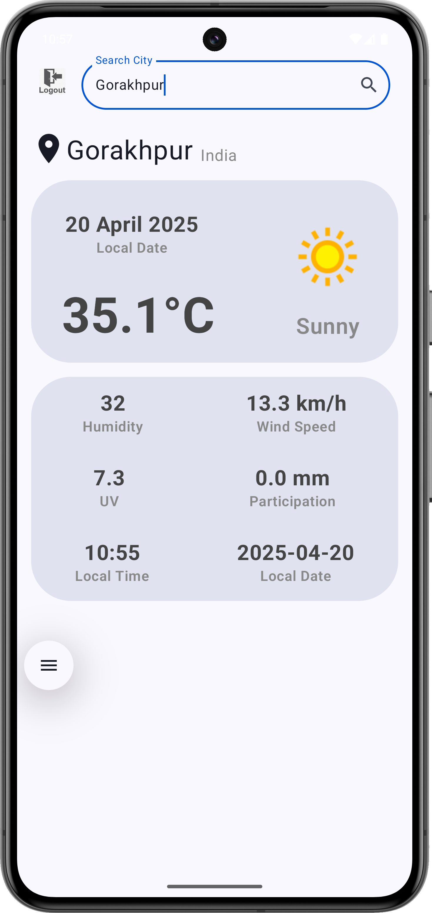

# 🌤️ WeatherApp

A sleek and modern Android Weather App built using **Jetpack Compose** and **Kotlin**. This app fetches real-time weather data from a remote API and displays it in a clean, user-friendly interface.

## 📱 Features

- 🔐 Firebase Authentication (Email/Password)
- 🔍 Search and display weather by city
- 📍 Location name and country display
- 🌡️ Current temperature with weather icon
- ☀️ Weather condition text (e.g., Sunny, Cloudy)
- 💨 Wind speed, 💧 humidity, 🌊 precipitation
- 🕒 Local time and date of the location
- 🌐 Asynchronous image loading with `AsyncImage`

## 🛠️ Built With

- **Kotlin**
- **Jetpack Compose** – Modern declarative UI toolkit
- **MVVM Architecture**
- **Coil** – Image loading
- **Retrofit** – Network calls
- **Firebase Authentication – User login & signup**
- **ViewModel + LiveData/State**

## 📸 Screenshots

| Weather Display |
|------------------|
|  |

## 📦 Installation

1. Clone the repository:

```bash
git clone https://github.com/yourusername/WeatherApp.git
cd WeatherApp
```

2. Open the project in **Android Studio**.

3. Add your API key in `Constants.kt`:
```kotlin
const val API_KEY = "your_api_key_here"
```

4. Run the app on an emulator or physical device.

## 🌐 API Reference

This app uses the **WeatherAPI** (or your chosen API). You can get your free API key from [https://www.weatherapi.com/](https://www.weatherapi.com/).

## 🤝 Contributing

Contributions are welcome! Feel free to fork the repo and submit pull requests.

## 📄 License

This project is licensed under the MIT License - see the [LICENSE](LICENSE) file for details.
